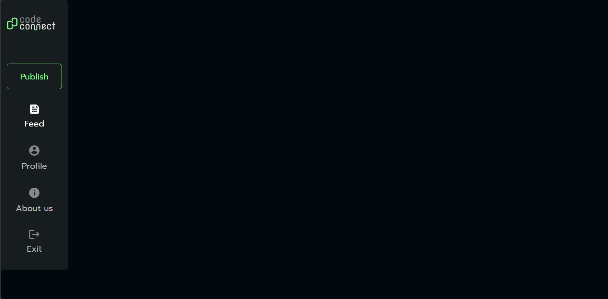
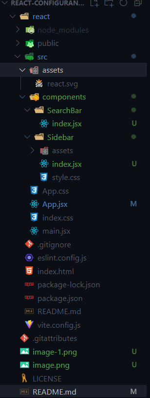
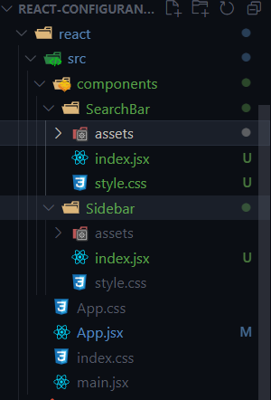
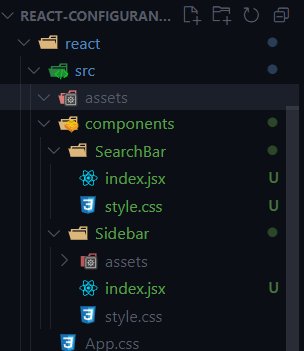

# React-configurando-e-estruturando-o-projeto-com-vite
 Project derived from the course "React: configurando e estruturando o projeto com Vite" from Alura

## First commands
1. Run: npm npm create vite@latest -- --template react
2. cd react
3. npm install
    - Chose: React and JavaScript.
4. npm run dev
Learn more at: https://vitejs.dev/guide/

## Folders
1. Create the folder 'components' inside react's folder;
2. Create the folder of your components, in this project, the first one was 'Sidebard';
3. Create the 'index.jsx' file inside react's folder.

git commit -m "Base do Projeto concluida"

## Sidebar components
1. Create the Sidebar function component and export it inside in react/src/components/index.jsx;
    ```
    export default function Sidebar() {
        return(
            
        )
    }
    ```
2. Go to the figma prototype and export the images and icons(svg);
3. Create the folder 'assets' in react/src/components/Sidebar/;
4. Store the images and icons in react/src/components/Sidebar/assets;
5. Import the Logo and create the img tag within the aside one:
    ```
    import Logo from './Sidebar/ assets/profile.svg';

    export default function Sidebar() {
        return(
            <aside>
                
            </aside>
        )
    }
    ```
6. Create a 'nav' tag inside 'aside' tag, then create a list that will contain an 'a' tag:
    ```
    <aside>
        
        <nav>
            <ul>
                <li>
                    <a href='#'>Publish</a>
                </li>
            </ul>
        </nav>
    </aside>
    ```

7. Create another 'li' tag; and continue doing the rest of the html structure accordingly to the prototype in Figma.
    ```
    import Logo from './Sidebar/assets/logo.svg';
    import Feed from './Sidebar/assets/feed.svg';
    import Profile from './Sidebar/assets/account_circle.svg';
    import AboutUs from './Sidebar/assets/info.svg';
    import Exit from './Sidebar/assets/logout.svg';


    export default function Sidebar() {
        return(
            <aside>
                
                <nav>
                    <ul>
                        <li>
                            <a href='#'>Publish</a>
                        </li>
                        <li>
                            <a href="#">
                                
                                <span>Feed</span>
                            </a>
                        </li>
                        <li>
                            <a href="#">
                                
                                <span>Perfil</span>
                            </a>
                        </li>
                        <li>
                            <a href="#">
                                
                                <span>About us</span>
                            </a>
                        </li>
                        <li>
                            <a href="#">
                                
                                <span>Exit</span>
                            </a>
                        </li>
                    </ul>
                </nav>
            </aside>
        )
    }
    ```

git commit -m "Coded the HTML for the sidebar link"

## Variables for styles
1. Remove everything wrapped around the return's parentesses and all imports except the './App.css', in codeconnect/react/src/App.jsx:
    ```
    import './App.css'

    function App() {
    return (

    )
    }

    export default App
    ```
2. Import the Sidebar  from './components/Sidebar' and insert the Sidebar inside the return's parentesses:
    ```
    import './App.css'
    import Sidebar from './components/Sidebar'

    function App() {
        return (
            <Sidebar />
        )
    }
    export default App
    ```
Run in the terminal: ```npm run dev``` to see the result. 

3. Remove all code in :
    - codeconnect/react/src/App.css;
    - codeconnect/react/src/index.css;
4. Create variables in codeconnect/react/src/index.css by looking at the prototype.
    - Import fonts from Google Fonts;
    ```
    :root {
    --highlight-green: #81FE88;
    --pastel-green: #BFFFC3;
    --petroleum-green: #132E35;
    --graphite: #01080E;
    --dark-gray: #171D1F;
    --gray: #3E3E3F;
    --medium-gray: #888888;
    --light-gray: #BCBCBC;
    --offwhite: #E1E1E1;
    --white: #FFFFFF;
    --font: "Prompt", sans-serif;
    }
    ```

5. Reset the css styles.
- Check this reset and use or just make a simple reset: <a href="https://piccalil.li/blog/a-more-modern-css-reset/#:~:text=Resets%20are%20one%20of%20those%20things%20that%20people">A (more) Modern CSS Reset</a>
    ```
    * {
    margin: 0;
    padding: 0;
    box-sizing: border-box;
    }
    ```
git commit -m "Adiction of variables and reset"

## Styling the Sidebar component
1. Create a style.css file in codeconnect/react/src/components/Sidebar/;
2. Import the style.css in the index.jsx which is in codeconnect/react/src/;
    ```
    import './Sidebar/style.css';
    ```
3. Start styling the Sidebar in the codeconnect/react/src/components/Sidebar/style.css.

4. http://localhost:5173/:


git commit -m "Completed styles of the Sidebar component"

## Search bar component
1. Create a new folder called 'SearchBar' in codeconnect/react/src/components/;

2. Create a new file called 'index.jsx' in codeconnect/react/src/components/SearchBar/;

    

3. Create and export the SearchBar function component in codeconnect/react/src/components/SerachBar/index.jsx:
    ```
    export default function SearchBar(){
        return(
            
        )
    }
    ```
4. Download the medias from the prototype;

5. Create a new folder called 'assets' in codeconnect/react/src/SearchBar/ and store the imagens and icons;

    

6. Code the html structure in codeconnect/react/src/SearchBar/index.jsx;
    ```
    import './style.css';

    export default function SearchBar(){
        return(
            <input type="search" placeholder="Type what you wish" className="search-bar"/>
        )
    }
    ```

7. Create a new file called 'style.css' in codeconnect/react/src/components/SearchBar/;
    

8. Import the style.css file in codeconnect/react/src/components/SearchBar/index.jsx;
    ```
    import './style.css';
    ```
9. Style the search bar in the codeconnect/react/src/components/SearchBar/style.css:
    ```
    .search-bar{
        width: 100%;
        color: var(--light-gray);
        padding: .5em 1em .5em 4em;
        height: 49px;
        font-family: var(--font);
        font-size: 22px;
        background: var(--dark-gray) url('./assets/search.svg') no-repeat 32px;
        border: none;
        border-radius: 4px;
    }
    ```

10. In the codeconnect/react/src/App.jsx, import the SearchBar component:
    ```
    import SearchBar from './components/SearchBar'
    ```
11. Wrap the Components in an parent tag in the file codeconnect/react/src/App.jsx
    ```
    function App() {
        return (
            <div>
                <Sidebar />
                <SearchBar />
            </div>
        )
    }
    ```

